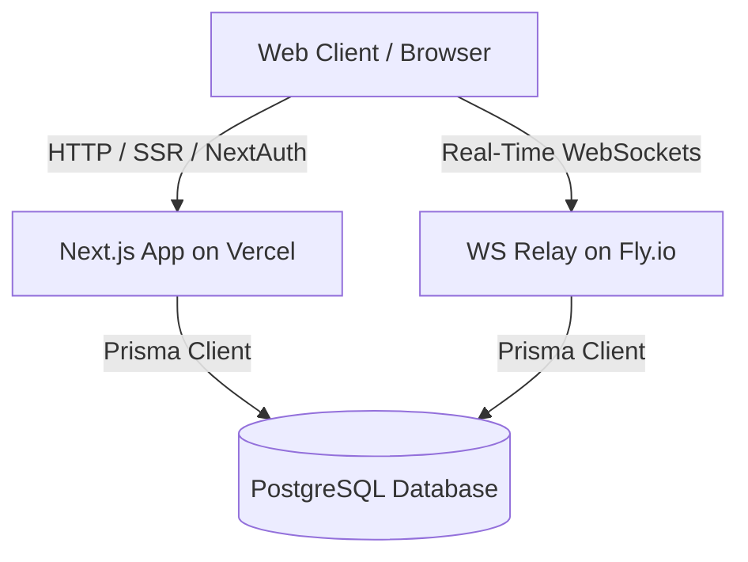
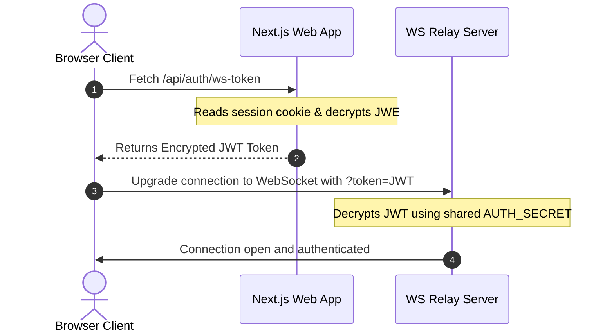

# DocSync Deployment & Architecture Guide

This document explains the architecture, two-service topology, and deployment procedure for DocSync.

---

## 1. Two-Service Topology

DocSync is structured as a **split-service architecture** consisting of two main services that communicate with the same central PostgreSQL database:



### Why the WebSocket Relay is a Standalone Service

1. **Serverless Limitations (Vercel)**:
   - Next.js apps deployed to Vercel (or similar serverless platforms) run in **stateless, ephemeral serverless functions**.
   - Serverless functions are designed for quick request/response cycles and have a maximum execution timeout.
   - They **cannot hold persistent, long-lived bidirectional connections** (such as WebSockets) required for real-time collaborative editing.

2. **Persistent Process (Fly.io / Railway)**:
   - The WebSocket relay server (`apps/ws-relay`) is an always-on, stateful Node.js process.
   - It maintains active TCP sockets for all connected clients, tracks cursor selections/awareness state in memory, and pipes database updates.
   - Therefore, it must be deployed to a platform that supports persistent container processes (like Fly.io or Railway).

---

## 2. Service Integration & Handshake

The two services find each other and establish secure trust via a JWE token handshake:



### Critical Environment Variables Configuration

To ensure authentication and database syncing succeed, the following environment variables **must match exactly** across both deployments:

1. **`AUTH_SECRET`**:
   - NextAuth v5 encrypts session cookies using `AUTH_SECRET`.
   - The WebSocket relay decrypts the session JWT using the same `AUTH_SECRET` to verify user identities.
   - If they differ, JWE decryption on the WebSocket relay will throw an exception, and all connection handshakes will fail with `401 Unauthorized`.

2. **`DATABASE_URL`**:
   - Both services connect to the same PostgreSQL instance to log document updates.
   - If they differ, updates made in the editor won't sync with the database seen by the web application.

---

## 3. Client Offline Resilience & Syncing

DocSync is designed **offline-first**, meaning client operations do not block when the WebSocket connection is offline:

1. **IndexedDB Outbox**:
   - Every local edit is immediately saved to the IndexedDB database in the browser before being pushed to the network.
   - If the connection status is `offline`, edits accumulate inside the local `outbox` table.

2. **Reconnection & Queue Draining**:
   - The `SyncScheduler` monitors connection health and uses an exponential backoff reconnect loop.
   - Upon successful reconnection, the client triggers `drainOutbox()` which uses an active loop to flush all buffered updates to the WebSocket server in order.
   - This ensures concurrent edits made while offline are safely merged without losing any data.

---

## 4. Step-by-Step Deployment Instructions

### Deploying the Next.js Web Application (Vercel)

1. Import your repository into Vercel.
2. Set the following environment variables:
   - `DATABASE_URL`: Hosted Postgres connection string (e.g., Neon or Supabase).
   - `AUTH_SECRET`: Generate a secure secret (`openssl rand -base64 33`).
   - `WS_RELAY_URL`: The URL of your deployed Fly.io relay (e.g., `wss://docsync-ws-relay.fly.dev`).
   - `AUTH_TRUST_HOST`: Set to `true` (critical for NextAuth v5 in production).
3. Click **Deploy**.

### Deploying the WebSocket Relay (Fly.io)

1. Install the `flyctl` CLI and login:
   ```bash
   fly auth login
   ```

2. Allocate the app using the configured `apps/ws-relay/fly.toml`:
   ```bash
   fly launch --config apps/ws-relay/fly.toml --dockerfile apps/ws-relay/Dockerfile
   ```

3. Configure environment secrets matching the Vercel deployment:
   ```bash
   fly secrets set DATABASE_URL="your-postgres-db-url" AUTH_SECRET="your-nextauth-auth-secret"
   ```

4. Deploy the process:
   ```bash
   fly deploy --config apps/ws-relay/fly.toml --dockerfile apps/ws-relay/Dockerfile
   ```
